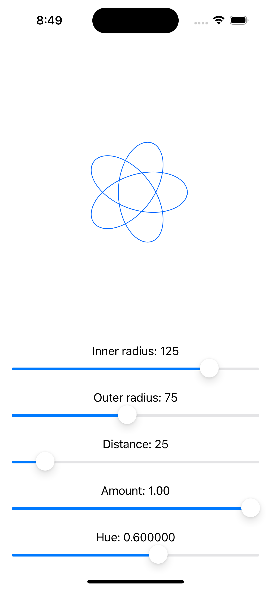
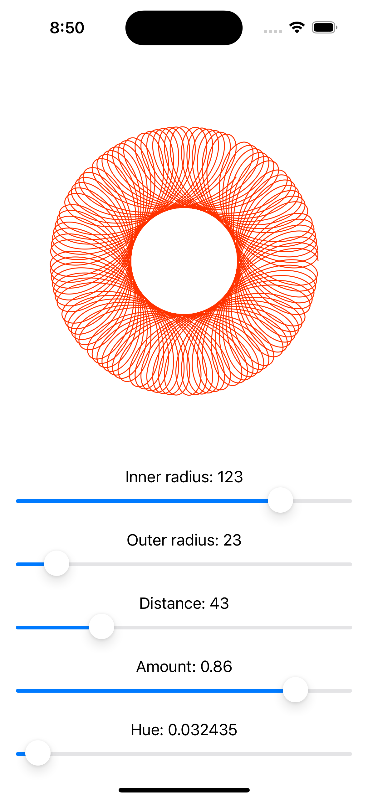

# Spirograph App

## Description

This is an app that is based on a YouTube tutorial. It has a couple of inputs and creates a spirograph based on the inputs. Just a fun little app that demonstrates how efficient the UI can update with complex graphical changes to state.

## Screenshots

[Spirograph Clip](https://drive.google.com/file/d/1mHD2sF2xGZh0QGB87dvoKk9rfjvMIGJv/view?usp=sharing)

